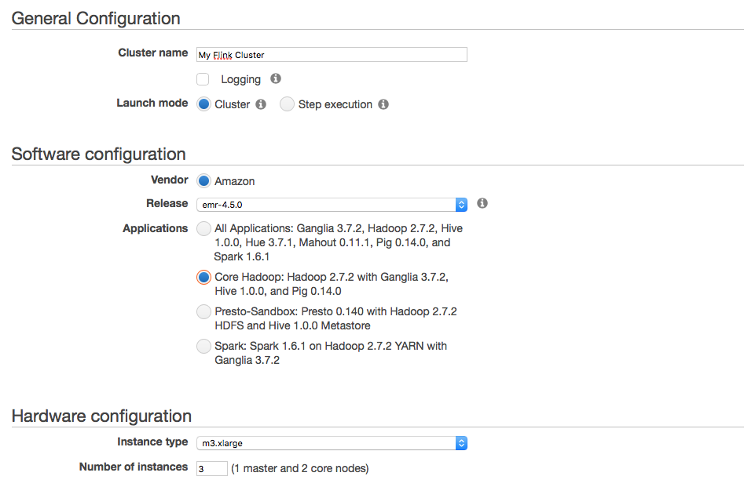

## Amazon Web Services (AWS)
AWS提供了能支持Flink运行的云计算服务。

### EMR: Elastic MapReduce

Amazon弹性MapReduce（Amazon EMR）是一种能实现快速Hadoop集群部署的Web服务。我们推荐使用这种方式在AWS上部署Flink，因为在这种方式下，AWS已经帮助大家配置好了跟Hadoop相关的设置。

#### 创建EMR集群
AWS提供的EMR文档中已经包含了一个创建并启动EMR集群的示例，链接如下：

http://docs.aws.amazon.com/ElasticMapReduce/latest/ManagementGuide/emr-gs-launch-sample-cluster.html

这个示例可以帮助大家创建任何EMR版本的集群。不过，为了使用Flink，你只需要在配置EMR时选择Core Hadoop就可以了，而不需要去配置诸如Hue等任何其他组件。



为了能够访问S3中的数据，需要确保在创建集群的时候，配置IAM角色。

#### 在EMR中安装Flink

在完成集群创建后，就可以连接到Master节点，并安装Flink。步骤如下：

* 到Flink官网的下载页面下载Flink的二进制安装包。需注意的是，Flink的安装包必须符合上文所创建的EMR集群的Hadoop版本。例如：Hadoop 2.7所对应的EMR发行版为4.3.0、4.4.0或者4.5.0。

* 将下载的Flink二进制安装包解压到其安装目录中。随后，只要设置好Hadoop配置文件的路径，就可以部署Flink作业（YARN-cluster模式）。
```
HADOOP_CONF_DIR=/etc/hadoop/conf bin/flink run -m yarn-cluster examples/streaming/WordCount.jar
```

### 亚马逊S3存储

亚马逊的S3存储提供了一种在云计算环境下访问对象存储的能力，且可以适用于各种应用场景。就Flink而言，可以使用S3存储来读写数据，或者用于保存流计算中各种状态信息的后台。

使用S3存储时，可以像使用常规文件系统一样，只需要指定其访问路径即可。格式如下：

```
s3://<your-bucket>/<endpoint>
```

上述访问格式中的endpoint可以是一个文件，也可以是一个目录，例如：

```
// Read from S3 bucket
env.readTextFile("s3://<bucket>/<endpoint>");

// Write to S3 bucket
stream.writeAsText("s3://<bucket>/<endpoint>");

// Use S3 as FsStatebackend
env.setStateBackend(new FsStateBackend("s3://<your-bucket>/<endpoint>"));```

注意：上述的示例并不面向特定的应用，因此我们完全可以将S3应用在其他方面，包括高可用和RocksDBStateBackend等，即所有Flink可以通过文件系统URI访问的场景。

#### 配置S3文件系统

> 注：当使用在EMR中使用Flink时，AWS已经帮你配置好了S3文件系统，因而可以忽略本节的内容。

Flink将S3当作常规的文件系统来处理，可以通过Hadoop的S3文件系统客户端来实现与S3的交互。

目前有2种常用的S3文件系统的实现：

* S3AFileSystem（推荐方式）：一种内部通过亚马逊SDK读写常规文件的文件系统，未限制最大文件尺寸，且使用IAM角色方式。

* NativeS3FileSystem：一种读写常规文件的文件系统，限制最大的对象大小为5GB，且不使用IAM角色的方式。

##### S3AFileSystem的实现方式（推荐方式）

我们推荐使用这种S3文件系统的实现方式，该方式使用亚马逊的SDK，并采用IAM角色的方式（详见“配置访问凭证（Credential）”一节）。

采用这种方式需要确保在Flink中正确配置了Hadoop配置文件目录的位置，并确保在core-site.xml中包含如下配置项：

```
<property>
  <name>fs.s3.impl</name>
  <value>org.apache.hadoop.fs.s3a.S3AFileSystem</value>
</property>

<!-- Comma separated list of local directories used to buffer
     large results prior to transmitting them to S3. -->
<property>
  <name>fs.s3.buffer.dir</name>
  <value>/tmp</value>
</property>
```
这一配置项会将S3AFileSystem注册为前缀为s3://的URI的缺省文件系统。

##### NativeS3FileSystem的实现方式

这一S3文件系统的实现方式限制单个文件的大小为5GB，且不支持IAM角色。这就意味着用户必须在Hadoop的配置文件中手动配置AWS访问凭证。

同样，在这种模式下仍然需要确保在Flink中正确配置了Hadoop配置文件目录的位置，并确保在core-site.xml中包含如下配置项：

```
<property>
  <name>fs.s3.impl</name>
  <value>org.apache.hadoop.fs.s3native.NativeS3FileSystem</value>
</property>
```
这一配置项会将NativeS3FileSystem注册为前缀为s3://的URI的缺省文件系统。

##### 指定Hadoop的配置目录

在Flink中，有多种指定Hadoop配置文件目录位置的方法，其中的一种方法是在flink-conf.yaml中指定Hadoop配置文件的路径：

```
fs.hdfs.hadoopconf: /path/to/etc/hadoop
```

上述配置会在Flink中将路径/path/to/etc/hadoop配置为Hadoop的配置文件位置。

#### 配置访问凭证（Credential）
> 注：当使用在EMR中使用Flink时，可忽略本节的内容。

在配置好S3文件系统后，还需要确保Flink有访问S3桶的权限。

##### 身份和访问管理IAM（推荐方式）

我们推荐采用AWS身份和访问管理（IAM）的方式。IAM方式允许Flink实例安全的获得其访问S3桶所需要的凭证（Credential）。关于的IAM实现这一机制的技术细节，已经超出了这个文档的范围。如果想进一步了解IAM机制，请参考AWS用户手册中关于IAM角色（IAM Roles）的有关内容。

只要能正确的在IAM中配置完IAM，那么在使用AWS实例时，就可以在不需要将访问秘钥分发给Flink实例的情况下，实现对S3的访问。

需要指出的是，这一IAM的方式只支持S3AFileSystem，而不支持NativeS3FileSystem。

##### 设置访问秘钥（不推荐使用）

访问S3资源还可以通过访问账号和秘钥的方式。不过需要指出的是，在IAM角色的认证方式出现以后，我们并不推荐继续使用这种基于访问秘钥的方式。

如果需要使用这种方式，需要在core-site.xml中设置fs.s3.awsAccessKeyId和 fs.s3.awsSecretAccessKey两个配置项：

```
<property>
  <name>fs.s3.awsAccessKeyId</name>
  <value></value>
</property>

<property>
  <name>fs.s3.awsSecretAccessKey</name>
  <value></value>
</property>
```

### S3文件系统的依赖关系

> 注：当使用在EMR中使用Flink时，可忽略本节的内容。

Hadoop S3文件系统的客户端打包在hadoop-aws中，Flink为此需要将该JAR包及其依赖包需要加入到它的CLASSPATH中，包括Job和TaskManager。根据所使用文件系统的实现方式及Hadoop和Flink版本的不同，依赖包也会随之不同。

有多种将依赖的JAR加入到Flink搜索路径中的方法，其中最简单的一种方法是将JAR包直接拷贝至Flink_HOME/lib目录中。一方面，需要拷贝hadoop-aws及其所有依赖包，另一方面也需要在所有集群节点中将包含这些JAR包的目录加入到HADOOP_CLASSPATH环境变量中。

#### Flink for Hadoop 2.7

基于所使用S3文件系统的实现方式，请分别加入以下的依赖关系包。这些JAR包可以在位于hadoop-2.7/share/hadoop/tools/lib目录下：

* S3AFileSystem:
  * hadoop-aws-2.7.2.jar
  * aws-java-sdk-1.7.4.jar
  * httpcore-4.2.5.jar
  * httpclient-4.2.5.jar
* NativeS3FileSystem:
  * hadoop-aws-2.7.2.jar
  * guava-11.0.2.jar

注意：hadoop-common已经被包含在Flink软件包中了，但Guava需要自行加入。

#### Flink for Hadoop 2.6

基于所使用S3文件系统的实现方式，请分别加入以下的依赖关系包。这些JAR包可以在位于hadoop-2.6/share/hadoop/tools/lib目录下：

* S3AFileSystem:
  * hadoop-aws-2.6.4.jar
  * aws-java-sdk-1.7.4.jar
  * httpcore-4.2.5.jar
  * httpclient-4.2.5.jar
* NativeS3FileSystem:
  * hadoop-aws-2.6.4.jar
  * guava-11.0.2.jar

注意：hadoop-common已经被包含在Flink软件包中了，但Guava需要自行加入。

#### Flink for Hadoop 2.4及其之前的版本

Hadoop 2.4之前（含）的版本只支持NativeS3FileSystem。在Flink for Hadoop 2.x版本中，NativeS3FileSystem已经包含在了hadoop-common中，因而不需要在CLASSPATH中新增JAR包。

### 常见问题

以下章节中列举了一些在AWS中运行Flink时的一些常见问题。

#### S3文件系统配置缺失

如果当作业提交时出现了诸如“No file system found with scheme s3”的错误，则表示S3文件系统没有正确的配置。关于S3文件系统的配置问题，请参考“配置S3文件系统”中的有关内容。

```
org.apache.flink.client.program.ProgramInvocationException: The program execution failed:
  Failed to submit job cd927567a81b62d7da4c18eaa91c3c39 (WordCount Example) [...]
Caused by: org.apache.flink.runtime.JobException: Creating the input splits caused an error:
  No file system found with scheme s3, referenced in file URI 's3://<bucket>/<endpoint>'. [...]
Caused by: java.io.IOException: No file system found with scheme s3,
  referenced in file URI 's3://<bucket>/<endpoint>'.
    at o.a.f.core.fs.FileSystem.get(FileSystem.java:296)
    at o.a.f.core.fs.Path.getFileSystem(Path.java:311)
    at o.a.f.api.common.io.FileInputFormat.createInputSplits(FileInputFormat.java:450)
    at o.a.f.api.common.io.FileInputFormat.createInputSplits(FileInputFormat.java:57)
    at o.a.f.runtime.executiongraph.ExecutionJobVertex.<init>(ExecutionJobVertex.java:156)
```

#### 未指定AWS访问KEY ID和秘钥未指定

如果当作业提交时出现了诸如“AWS Access Key ID and Secret Access Key must be specified as the username or password”的错误，则表示S3的访问凭据配置有误。关于S3文件系统的访问凭据问题，请参考“配置访问凭证（Credential）”一节中的有关内容。

```
org.apache.flink.client.program.ProgramInvocationException: The program execution failed:
  Failed to submit job cd927567a81b62d7da4c18eaa91c3c39 (WordCount Example) [...]
Caused by: java.io.IOException: The given file URI (s3://<bucket>/<endpoint>) points to the
  HDFS NameNode at <bucket>, but the File System could not be initialized with that address:
  AWS Access Key ID and Secret Access Key must be specified as the username or password
  (respectively) of a s3n URL, or by setting the fs.s3n.awsAccessKeyId
  or fs.s3n.awsSecretAccessKey properties (respectively) [...]
Caused by: java.lang.IllegalArgumentException: AWS Access Key ID and Secret Access Key must
  be specified as the username or password (respectively) of a s3 URL, or by setting
  the fs.s3n.awsAccessKeyId or fs.s3n.awsSecretAccessKey properties (respectively) [...]
    at o.a.h.fs.s3.S3Credentials.initialize(S3Credentials.java:70)
    at o.a.h.fs.s3native.Jets3tNativeFileSystemStore.initialize(Jets3tNativeFileSystemStore.java:80)
    at sun.reflect.NativeMethodAccessorImpl.invoke0(Native Method)
    at sun.reflect.NativeMethodAccessorImpl.invoke(NativeMethodAccessorImpl.java:57)
    at sun.reflect.DelegatingMethodAccessorImpl.invoke(DelegatingMethodAccessorImpl.java:43)
    at java.lang.reflect.Method.invoke(Method.java:606)
    at o.a.h.io.retry.RetryInvocationHandler.invokeMethod(RetryInvocationHandler.java:187)
    at o.a.h.io.retry.RetryInvocationHandler.invoke(RetryInvocationHandler.java:102)
    at o.a.h.fs.s3native.$Proxy6.initialize(Unknown Source)
    at o.a.h.fs.s3native.NativeS3FileSystem.initialize(NativeS3FileSystem.java:330)
    at o.a.f.runtime.fs.hdfs.HadoopFileSystem.initialize(HadoopFileSystem.java:321)
```

#### ClassNotFoundException: NativeS3FileSystem/S3AFileSystem未找到

如果出现了类似这样的ClassNotFoundException，则表示S3文件系统并没有包含在Flink的CLASSPATH中。对此，请参考“S3文件系统的依赖关系”一节中的有关内容。

```
Caused by: java.lang.RuntimeException: java.lang.RuntimeException: java.lang.ClassNotFoundException: Class org.apache.hadoop.fs.s3native.NativeS3FileSystem not found
  at org.apache.hadoop.conf.Configuration.getClass(Configuration.java:2186)
  at org.apache.flink.runtime.fs.hdfs.HadoopFileSystem.getHadoopWrapperClassNameForFileSystem(HadoopFileSystem.java:460)
  at org.apache.flink.core.fs.FileSystem.getHadoopWrapperClassNameForFileSystem(FileSystem.java:352)
  at org.apache.flink.core.fs.FileSystem.get(FileSystem.java:280)
  at org.apache.flink.core.fs.Path.getFileSystem(Path.java:311)
  at org.apache.flink.api.common.io.FileInputFormat.createInputSplits(FileInputFormat.java:450)
  at org.apache.flink.api.common.io.FileInputFormat.createInputSplits(FileInputFormat.java:57)
  at org.apache.flink.runtime.executiongraph.ExecutionJobVertex.<init>(ExecutionJobVertex.java:156)
  ... 25 more
Caused by: java.lang.RuntimeException: java.lang.ClassNotFoundException: Class org.apache.hadoop.fs.s3native.NativeS3FileSystem not found
  at org.apache.hadoop.conf.Configuration.getClass(Configuration.java:2154)
  at org.apache.hadoop.conf.Configuration.getClass(Configuration.java:2178)
  ... 32 more
Caused by: java.lang.ClassNotFoundException: Class org.apache.hadoop.fs.s3native.NativeS3FileSystem not found
  at org.apache.hadoop.conf.Configuration.getClassByName(Configuration.java:2060)
  at org.apache.hadoop.conf.Configuration.getClass(Configuration.java:2152)
  ... 33 more
```

#### IOException: 400: Bad Request

假定所有的配置项都已经正确的设置了，如果你的S3桶刚好位于eu-central-1，则仍然有可能会收到Bad Request异常。这是可能是因为你所使用的S3客户端不支持亚马逊第4版本的签名。

目前，这一问题涉及到Hadoop 2.7.2版本为止的所有运行NativeS3FileSystem文件系统的客户端——该客户端依赖于JetS3t 0.9.0，而不是推荐使用的>= 0.9.4的S3客户端。

现在，规避这一问题的唯一方法是改变S3桶的所在为止。

```
[...]
Caused by: java.io.IOException: s3://<bucket-in-eu-central-1>/<endpoint> : 400 : Bad Request [...]
Caused by: org.jets3t.service.impl.rest.HttpException [...]
```

#### 源自org.apache.hadoop.fs.LocalDirAllocator的NullPointerException

这个异常通常是由于使用S3AFileSystem时未设置本地缓冲目录配置项（fs.s3.buffer.dir）引起的。对此，可以参加有关S3AFileSystem配置方法的章节。

```
[...]
Caused by: java.lang.NullPointerException at
o.a.h.fs.LocalDirAllocator$AllocatorPerContext.confChanged(LocalDirAllocator.java:268) at
o.a.h.fs.LocalDirAllocator$AllocatorPerContext.getLocalPathForWrite(LocalDirAllocator.java:344) at
o.a.h.fs.LocalDirAllocator$AllocatorPerContext.createTmpFileForWrite(LocalDirAllocator.java:416) at
o.a.h.fs.LocalDirAllocator.createTmpFileForWrite(LocalDirAllocator.java:198) at
o.a.h.fs.s3a.S3AOutputStream.<init>(S3AOutputStream.java:87) at
o.a.h.fs.s3a.S3AFileSystem.create(S3AFileSystem.java:410) at
o.a.h.fs.FileSystem.create(FileSystem.java:907) at
o.a.h.fs.FileSystem.create(FileSystem.java:888) at
o.a.h.fs.FileSystem.create(FileSystem.java:785) at
o.a.f.runtime.fs.hdfs.HadoopFileSystem.create(HadoopFileSystem.java:404) at
o.a.f.runtime.fs.hdfs.HadoopFileSystem.create(HadoopFileSystem.java:48) at
... 25 more
```
